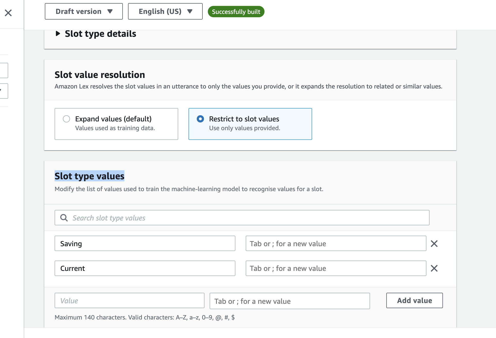

**Last Updated:** April 2019

# Building Chatbots with Amazon Lex

## Overview

Amazon Lex is a service for building conversational interfaces into any application using voice and text. Amazon Lex provides the advanced deep learning functionalities of automatic speech recognition (ASR) for converting speech to text, and natural language understanding (NLU) to recognize the intent of the text, to enable you to build applications with highly engaging user experiences and lifelike conversational interactions. With Amazon Lex, the same deep learning technologies that power Amazon Alexa are now available to any developer, enabling you to quickly and easily build sophisticated, natural language, conversational bots (&quot;chatbots&quot;). This lab is designed to demonstrate how to create a new bot including defining intents and slots. This lab will walk you through the following:

- Creating a Lex bot
- Adding intents
- Adding slot types
- Using AWS Lambda as the back-end logic for Lex

# Step 1a: Create the bot

1. Log in to the [AWS console](https://console.aws.amazon.com/lex/home) and navigate to the Amazon Lex service
2. check the url, you will see 'lexv2' as part of the url if you are in the V2 console
2. **Please ensure you have selected North Virginia as the region in the top right (Amazon Connect is not available in all regions yet)**
3. If you have never created a bot, click &quot;Create bot&quot; and you will be presented with the following screen.

4. select &quot;Create a blank bot&quot;, give it a name and an optional description
5. under "IAM permissions" select &quot;Create a role with basic...&quot;
6. Choose &quot;No&quot; to the Children&#39;s Online Privacy Protection Act (COPPA) question
7. Session timeout should be 5 minute
8. Click "Next" and select the your preferred language
9. Choose your preferred output voice
10. leave "Intent classification confidence score threshold" at default 40% and click &quot;Done&quot;

## 1b Create an Intent
An intent, which represents an action that the user wants to perform. For example, we&#39;re going to create a &quot;GetBalanceCheck&quot; intent in this lab;  (Afterwards you can follow the same process to create a separate intent for getting last transaction). It will allow user to check their account balance. This requires us to create custome slot to hold the account types.

1. Create the custom slot for account types
    - On the Lex Console, select the bot you created and click on "Slot types" on the left panel.
    - Click on &quot;Add slots type&quot; and select *Add blank slot type* give it a name and click on **Add**
    - On the panel that opens, select *Restrict to slot values* under **Slot value resolution**
    - scroll down to **Slot type values** and add *Saving* and *Current* 

    - click on the **Save slot type** button to save your first custom slot

2. Create the GetBalanceCheck intent
    - click on *Intents* on the left panel of the console, then click the *Add intent button*, select ***Add empty intent***
    - add **GetBalanceCheck** as *Intent name* then click the *Add button*
    - on the panel that opens, add an optional description
    We now want to provide samples of what our user would type or say to perform this action (i.e. to activate this intent)
    - sroll down to Sample utterances, switch to *Plain Text* and paste in the following utterances
    ```Check my bank balance
        how much money is in my account
        how much money do i have
        lexv2 accepts ulterance in the following formats:
        What’s the balance in my {accountType} account ?
        How much do I have in {accountType} ?
    ```
    - add additional ulterances as you chooses
    

    Next we define a slot which is information we need to process the users request. This information can be included in the utterance (query) that the user types or says, and if not included, Lex will prompt the user for the information. While Lex includes many built-in slot types (such as number, colour, city, food, etc), we will use the custom slot we created earlier.

    - Scroll down to the Slots pane and click on the *Add slot* button
    - ensure *Require for this intent* is checked
    - provide **AccountType** as the name 
    - click on *slot type* and select **AccountType** custom slot you created
    - Enter "What type of account do you want to check (Current or Savings)? as prompt

    
    - We are now going to ask a security follow up question and ask the user to enter their four digit pin number.
    - follow the steps again to create another slot that will use one of the amazon in-built slots
    - clicking the Add slot button, and this time use these values and then click the Add button:

    Name - PinNumber
    Slot type - AMAZON.Number
    Prompts - For verification purposes, what is your date of birth?
    
    It is worth noting as you build other intents you can modify the order of the Slot collection (ie what questions get asked in which order) and also whether or not the slot is "Required" before passing the values to our external function.
    - Scroll down and click &quot;Save Intent&quot;

3. Let&#39;s build this simple Bot: Hit the grey Build button at the top right corner. You will be asked for confirmation to build. Click &quot;Build&quot;.

The build process takes approximately a minute. Once complete, click on **Test** just beside **Build**. you can ask your bot a question as a way to test it. For example, you could type &quot;what is my balance ?&quot; in the chat window, or click the microphone symbol, speak your request and client it again to have Lex translate your speech to text. At this stage since we have not added in the backend Lambda function, the response will be *intent fulfilled...*


# Step 2: Fulfilling the bot 

We are now in a position that we can transfer the answers to the 'slots' over to a function to perform logic and get a result for the user.

Here we will create a Lambda function that has some Javascript code to detect the intent name (&#39;GetBalanceCheck&#39; and return values based on the AccountType and if the Pin number was entered correctly.

In the Lambda function we have hard-coded an Array of data but in a real world example we would have authenticated the user and would use a database lookup for the account balances.

1. Use the AWS Console to navigate to Lambda.
2. Click on the orange &#39;Create a function&#39; link under the &#39;Getting Started&#39; section
3. On the &quot;Create function&quot; page, click the &quot;Author from scratch&quot; button
4. Let&#39;s give our function the name of &quot;myPersonalBanker&quot; and optionally provide a description
5. Choose Node.js 14.x as the Runtime
6. Click on **Change default execution role** to expand and select *Create a new role from AWS policy templates*
7. We will &quot;Create new role from template – give it a Lex-style role name (such as &quot;LexRole&quot;)
8. Under *Policy templates*, click and enter &quot;Test Harness permissions&quot; to select the policy template.


1. Hit &quot;Create function&quot; on the bottom right and you&#39;ll be taken to the &quot;Configuration&quot; window.  We are not adding any additional triggers, nor are we using Lambda Layers, so scroll down to the &quot;Function code&quot; section
2. Open the lambda function code [myPersonalBanker_v2](./myPersonalBanker_v2.js) Copy and paste the code into the inline editor – make sure that you overwrite any template code that is already in the code box.
3. NOTE: If you used a different intent name apart from "GetBalanceCheck", go to line 131 of the code and replace 'GetBalanceCheck' to your intent name.
4. Leave the rest unchanged, then hit the grey &quot;Deploy&quot; button at the top of the screen

# Step 3: Link the bot with the Lambda function
- Linking lex bot v2 to our lambda function is slightly different compared to v1.

In this step we will link the intents we created to the Lambda function. We do this by providing the Lambda function as the method that contains the business logic used to &#39;fulfill&#39; the users requests. Once this is done (and the bot rebuilt), when a user specifies an intent (such as &#39;what is my checking account balance&#39;), Lex will call our Lambda function and pass it the intent name (&#39;GetAccountDetail&#39;) and the slot value (&#39;checking&#39;).

To do this, we go back to the [Lex Console](https://console.aws.amazon.com/lex).

1. Click on `PersonalBanker` bot
2. On the left-hand menu select the Aliases link. You will have this screen

3. Select the default `TestBotAlias`, then from the Languages panel select `English(US)`
4. On the dialogbox select the lambda function we created as the `source` and `$LATEST` as seen below.


##  Enabling Lambda code hooks on the intents
1. Navigate to your intent by clicking on the on the left menu
2. Scroll down to the Fulfillment pane. 
3. Click on the arrow next to `On successful fulfillment`, then click on `Advanced options button`

4. On the long list of the dialogbox go to the one marked `Fulfillment Lambda code hook` and click the checkbox, then click on the `Update options` button at the bottom of the panel.


5. Click &quot;Save intent&quot;
6. Click &quot;Build&quot; and then click &quot;Build&quot; again on the confirmation screen.

# Step 4: Running and debugging the bot

1. If you now test the bot as you did at the bottom of [Step 1](#testingthebot) you will see a sample response back from the lambda function. This function has been setup to show you how a very basic flow can be configured and over the next few steps we will modify the code to make the function more helpful.


The function 'closes' the Lex box with a message displaying the values passed into the slot. If you look within the Javascript for the function named 'simpleResponse' you should be able to see it does very little other than return data back to the user.

2. To make the application more useful we want to pass values into the function and retrieve data back from a data source (in this case an array but in production this could be a database). 

If you modify the lambda function and look for the line **'return simpleResponse(intentRequest, callback);'** and place '//' before this line and remove the '//' from the line below so it looks like:

``` javascript
    //return simpleResponse(intentRequest, callback);
    return balanceIntentError(intentRequest, callback);
    //return balanceIntent(intentRequest, callback);
```

Save your lambda function and retry the Lex bot. First off all try by choosing 'Saving' and saying the 'PinNumber' is 1234. You should now get a nice response from lex telling you of your account balance. However, at the moment your Lex box will error if you enter an incorrect PinNumber which is not helpful to the user. 


3. Finally we are going to add some error handling and a feedback loop to the user until a correct PinNumber is entered. The code will check to see if there is an account match and if not will request the user tries again and resets the 'Slot'.

If you modify the lambda function and look for the line **'return balanceIntentError(intentRequest, callback);'** and place '//' before this line and remove the '//' from the line below so it looks like:

``` javascript
    //return simpleResponse(intentRequest, callback);
    //return balanceIntentError(intentRequest, callback);
    return balanceIntent(intentRequest, callback);
```

# Conclusion

In this lab you have learned the basic operations to manage a Lex bot. First, you created a bot, then you defined intents and slot types. Finally you defined a Lambda function and attached it to your chatbot.

**NOTE We will be continuing on from this Lab in the second Lab so please do not delete the Lex Bot you have created in this exercise.**

# STEP 5. Integrating your bot into your website.
Follow the steps in the documentation to integrate lex chat bot to your website using [komunicate](https://docs.kommunicate.io/docs/bot-lex-integration)

# STEP 6. Deploy your website on AWS Amplify
For a stet-by-step guild on how you can deploy your wesite on AWS Amplify, visit my other project in this [repository](https://github.com/chimezdev/WildRydes-serverless-app-AWS)
